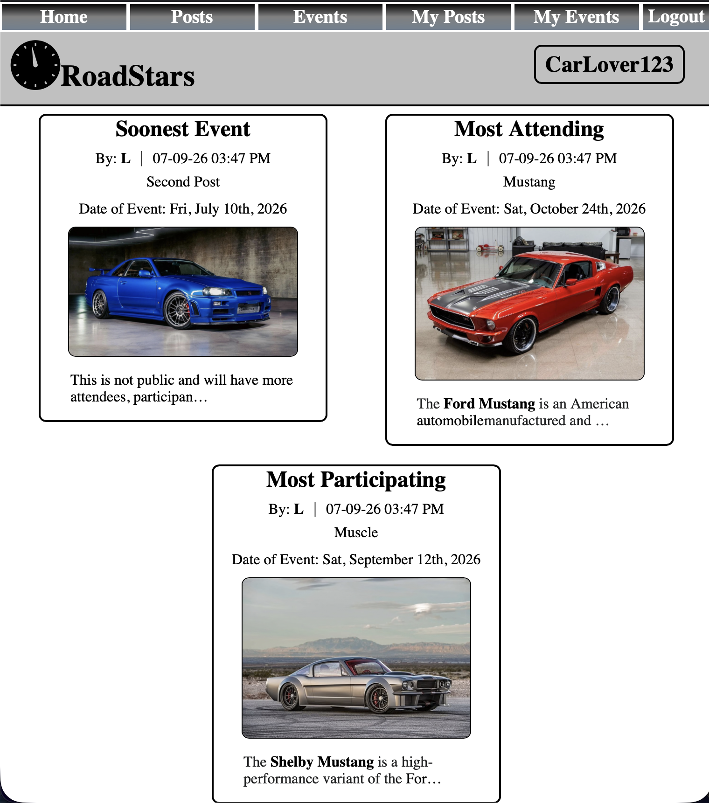

# ROADSTARS



##Deployed App Link


## Attributions
* https://www.istockphoto.com
    * Utilized for non-copyrighted images
* https://developer.mozilla.org/
    * Resource for information
* https://www.w3schools.com/
    * Resource for information
* https://www.wikipedia.org
    * Resource for placeholder text

## Technologies Used
* Django
* Postgresql
* Python
* HTML 
* CSS
    * ckeditor_5
    * Pillow

## Future Goals
#### [ ] Add Comments (potentially with image capabilities)
#### [ ] A like & dislike for posts
#### [ ] The ability for users to post multiple images in a single post, also for events
#### [ ] A way for users to directly sign up to attend or participate in events rather than just providing contact information
#### [ ] Method for users to send event organizers applications directly
#### [ ] Method for organizers to provide printable passes or electronic passes that can be presented directly from app
#### [ ] Also an authentication method so those passes cant faked or duplicated
#### [ ] A method for monetization possibly providing a way to purchase electronic passes through site or providing a store for members to sell merch
#### [ ] Maybe even charging for the advertisement of for profit events


## Interesting code 
### Custom Texteditor for Fields

``` 
CKEDITOR_5_CONFIGS = {
    'default': {
        'toolbar': [
            'heading', '|',
            'alignment', '|',
            'fontSize', '|',
            'bold', 'italic', 'underline', 'strikethrough', 'link', 'bulletedList', 'numberedList', '|',
            'blockQuote', 'insertTable', '|',
        ],
        "removePlugins": ["MediaEmbedToolbar", "ImageToolbar"],
        'alignment': {
            'options': ['left', 'center', 'right', 'justify']
        },
        'fontSize': {
            'options': [9, 10, 11, 12, 13, 14, 'default', 16, 17, 18, 19, 20, 21 ]
        },
        'contentCss': [
            'myproject/main_app/static/css/form.css'
        ]
    }
}
```
### Uploading Images
```
def image(request):
    if request.method == 'POST':
        form = PostCreate(request.POST, request.FILES)
        if form.is_valid():
            form.save()
            return redirect('success')
    else:
        form = PostCreate()
    return render(request, 'form.html', {'form': form})
```
### Filtering data and Ordering
```
def home(request):
    posts = Post.objects.all()
    public_events = Event.objects.all().filter(public=True)
    earliest_event = Event.objects.all().order_by('event_date').first()
    public_earliest_event = public_events.order_by('event_date').first()
    most_attendees = Event.objects.all().order_by('attendees').last()
    public_most_attendees = public_events.order_by('attendees').last()
    most_participants = Event.objects.all().order_by('participants').last()
    public_most_participants = public_events.order_by('participants').last()
    return render(request, 'home.html', { 'posts': posts, 'earliest_event': earliest_event, 'most_attendees': most_attendees, 'public_earliest_event': public_earliest_event, 'public_most_attendees': public_most_attendees, 'most_participants': most_participants, 'public_most_participants': public_most_participants })
```
### Constraints
```
class Meta:
        constraints = [
            models.CheckConstraint(
                condition=(
                    Q(upload_image__isnull=False, image_URL__isnull=True) |
                    Q(image_URL__isnull=False, upload_image__isnull=True) |
                    Q(post_text__isnull=False)
                ), 
                name="Must submit something to create Post"
            )
        ]
```